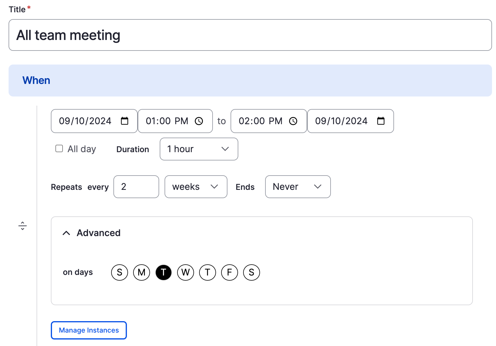
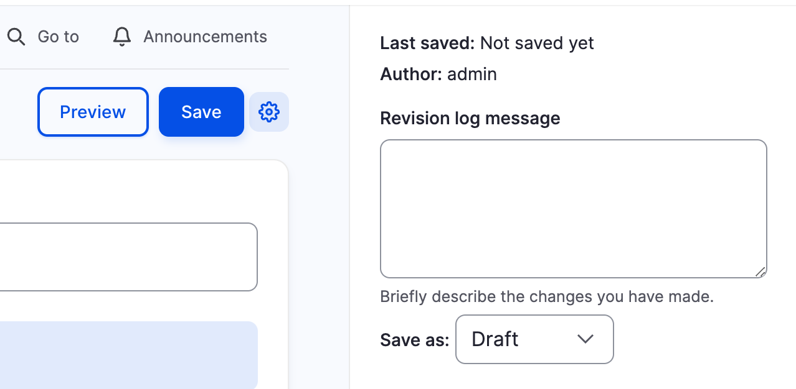
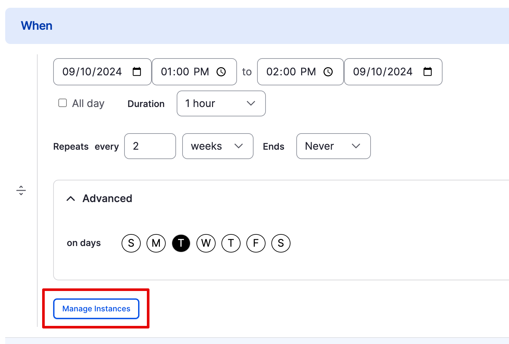
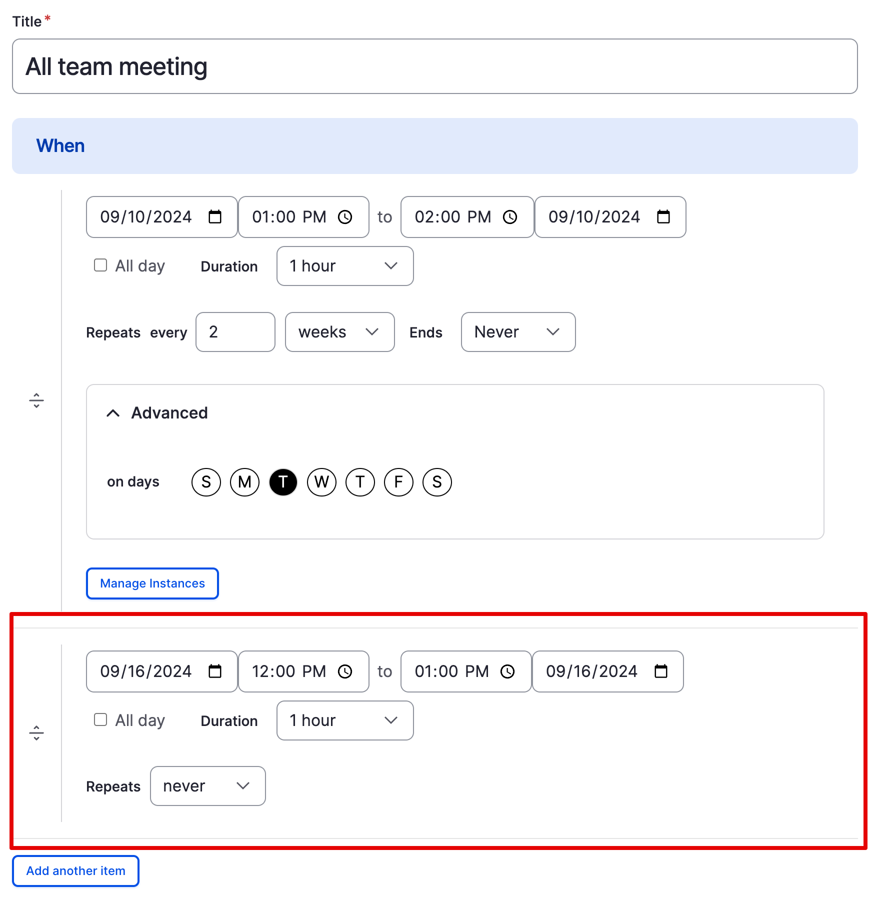

# Create a Recurring Event

## Summary

Have a weekly team call, or need to schedule a volunteer training that takes place at the same time from 9:00 am to 11:00 am over 3 consecutive days? Save time by creating a recurring event instead of multiple single events.

## Goal

Publish an event that repeats.

## Prerequisites

The Events feature must be enabled. If this was not done when the site was initially created, enable it before continuing. Learn more in [Enabling a New Feature](/bad-link.md). After the feature is enabled, it must be configured for recurring events. See the “Configure DXPR CMS for recurring events” section below.

## Configure DXPR CMS for recurring events

Before a content editor can create recurring events, an administrator will need to add a module and configure it.

1. Install the _Smart Date Recurring_ module. Learn how to [install modules](/bad-link.md).
1. Edit the _When_ field for the _Event_ content type. In the _Administration Toolbar_, navigate to _Structure_ > _Content types > Event_. Select the _Manage fields_ button for the _Event_ content type, then select the _Edit_ button for the _When_ field in the field list. (_/admin/structure/types/manage/event/fields/node.event.field\_when_).
1. Toggle _Allow recurring date values_ to **on**.

   <!-- 📸Screenshot: Field settings form for smart date field with recurring date values option toggled on. -->
   

1. Select _Save settings_ to update the field settings.

A content editor will now be able to use the recurring dates feature with DXPR CMS Events.

## How to create and publish a recurring event

1. In the _Administration Toolbar_ navigate to _Create_ > _Event_ (_/admin/event_).
1. Fill in the _Create Event_ form with the details for your event.

   **Title:** Enter a name for the event.

   **When:** Start by entering the date and time of the **first** occurrence of the event.

   Then configure the repeating sequence:

   1. Choose a repeating frequency (for example, daily or monthly).
   1. Set the relevant time frame for the event to repeat (for example, every 2 weeks). For events that repeat on specific days, open the _Advanced_ configuration, and choose the day(s) the event should repeat on.
   1. Configure when the recurring event will end by entering a specific number of occurrences or a specific date using the _Ends_ field.

      <!-- 📸Screenshot: Smart date field on event node configured to recur every other Tuesday. -->
      

   **Where:** Choose a location for the event from the list of available locations. To add new locations to the list see [Add a Location](/bad-link.md).

   **Body:** Add a detailed description of the event. The description can include formatted text, images, and other media. Learn more about [using the DXPR CMS text editor](/bad-link.md) and how to [manage media](/bad-link.md).

   By default, a trimmed version of the description is used on the _Events_ listing page. For more control over the content of the summary, select the _Edit summary_ link and fill in the _Summary_ field.
1. In the editor sidebar, the event’s _Current state_ value defaults to _Draft_. Leave it as _Draft_ to save the event as a draft. Or, set _Change to_ to _Published_, if you’re ready to publish the event. Draft events are only viewable by editors. Once published, the event will become available to the public.

   <!-- 📸Screenshot: Cropped image of publish/draft area of form. Repeat from previous tutorial. -->
   

4. Select the _Save_ button.

### Override a specific instance of a recurring event

What if you need to override a single occurrence of a recurring event? For example, an event that occurs once a week on Tuesday needs to be canceled on the date that it overlaps with a holiday.

1. In the _Administration Toolbar_, navigate to _Content_ (_/admin/content_).
1. Filter the list to display _Content type: Events_.
1. Find the event in the list and select the _Edit_ button.
1. Select the _Manage instances_ button for the _When_ field.

   <!-- 📸Screenshot: Of editing the "When" field with the manage instances button highlighted. -->
   

1. A modal window opens listing all future dates for the event. Find the one you wish to modify and select the _Override_ button.

### Add a one-off date to a recurring event

Add a specific date that falls outside the recurring schedule for special events, or other exceptions.

1. Edit the recurring event.
1. Under the _When_ section of the event form, select the _Add another item_ button to add an additional date that occurs outside of the recurring schedule.
1. Set the date and time of the one-off date.
1. Select the _Save_ button to save the updated event.

<!-- 📸Screenshot: "When" field on Event form with multiple date values added. One for "Every other Tuesday", and one for a "random Monday in September". -->

## Feedback

Was this helpful? [yes] | [no]

### Additional resources

- [Configure Content Types](/bad-link.md)
- [Add a Module](/bad-link.md)
- [Concept: Events](./events--overview.md)
- [Add a Single Event](./events--create-single.md)
