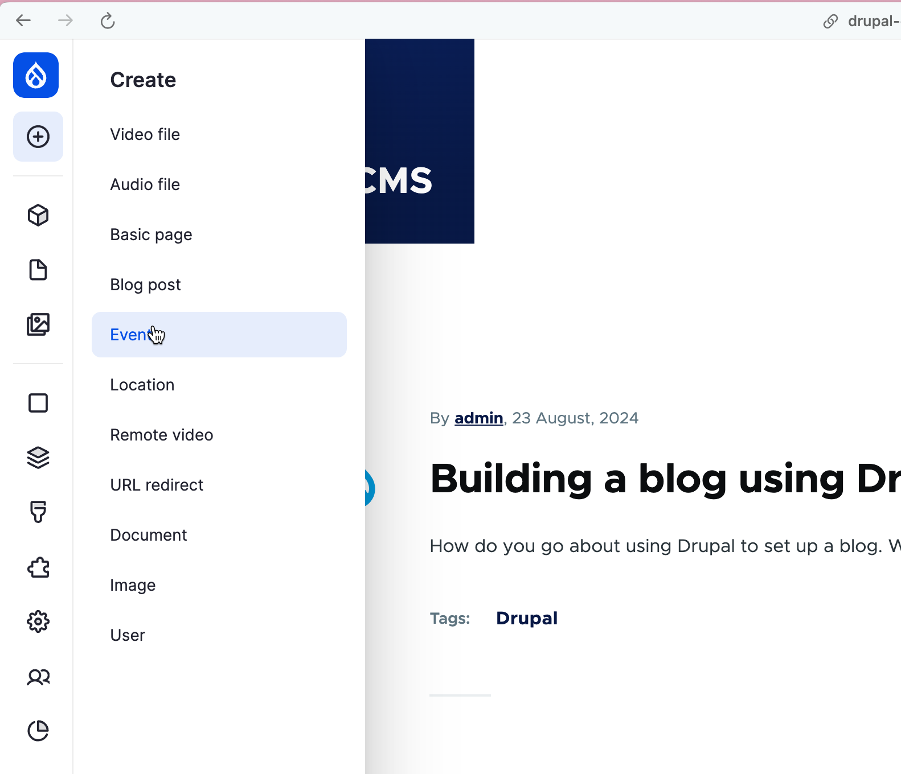
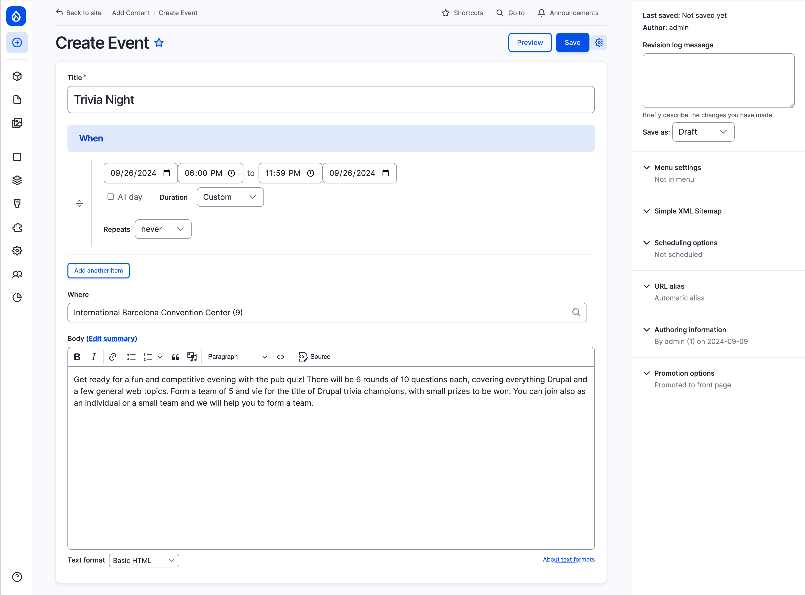
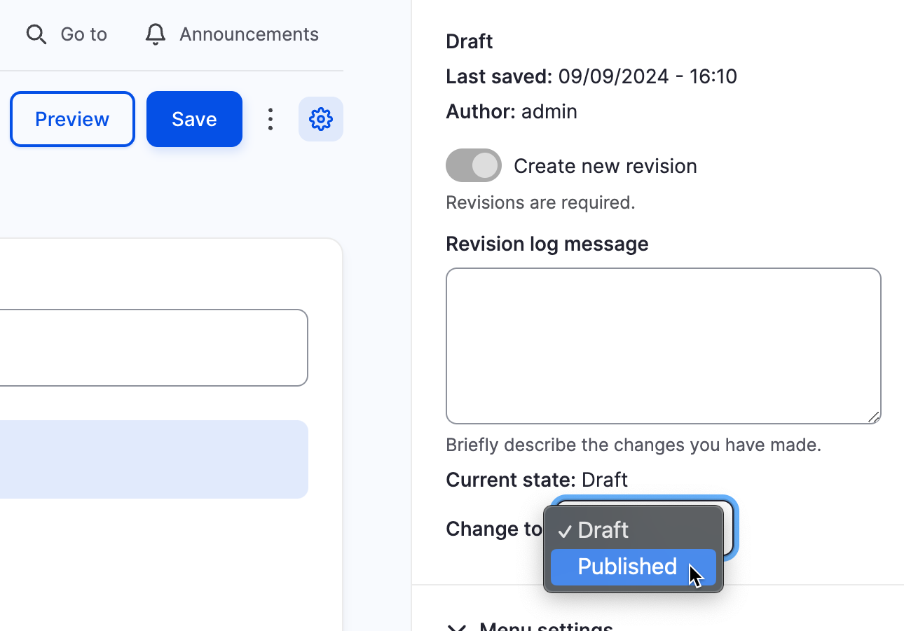

# Create a Single Event

## Summary

Learn to create one-off events like a meeting or a party. Start by creating and previewing an event draft. When everything looks good, publish the event, and share it with the world.

## Goal

Publish a new single occurrence event.

## Prerequisites

The Events feature must be enabled. If this was not done when the site was initially created, enable it before continuing. Learn more in [Enabling a New Feature](/bad-link.md).

## How to create and publish one-off events

!!! note "Tip"

  If you create the same event more than once, save time by [creating a recurring event](./events--create-recurring.md).

### Create an event draft

1. In the _Administration Toolbar_ navigate to _Create_ > _Event_ (_/admin/event_).

   <!-- 📸Screenshot: Cropped screenshot of admin toolbar showing where to find add an event in the menu. -->
   

1. Fill in the _Create Event_ form with the details for your event.

   **Title:** Enter a name for the event.

   **When:** Enter the dates and times for when the event begins and ends. Or choose *All day* for events that don’t have a specific time. For single occurrence events, enter *Repeats: never*.

   Tip: For events that happen more than once, but don’t follow any specific recurring pattern like weekly, or every 2nd Monday, you can add additional single dates for the same event by selecting the _Add another item_ option.

   **Where:** Choose a location for the event from the list of available locations. To add new locations to the list see [Add a Location](/bad-link.md).

   **Body:** Add a detailed description of the event. The description can include formatted text, images, and other media. Learn more about how to [use the DXPR CMS text editor](/bad-link.md) and [manage media](/bad-link.md).

   By default, a trimmed version of the description is used on the Events listing page. For more control over the content of the summary, select the *Edit summary* link and fill in the *Summary* field.

   <!-- 📸Screenshot: Event note form with form filled in. Cropped to show just the form. -->
   

1. In the editor sidebar, the Event’s _Current state_ will default to _Draft_. Leave it as _Draft_ to save the event as a draft. Or, set _Change to_ to _Published_ if you’re ready to publish the event. Draft events are only viewable by editors. Once published, the event will become available to the public.

   <!-- 📸Screenshot: Cropped image of publish/save section of event create form. -->
   

1. Select the _Save_ button.

### Publish an event

After creating a draft of the event and previewing the content to ensure it looks correct, publish your event to share it with the world.

To publish an event:

1. In the _Administration Toolbar_, navigate to _Content_ (_/admin/content_).
1. Filter the list to display _Content type: Events_ and _Published status: Draft_.
1. Find the event in the list and select the _Edit_ button.
1. In the sidebar, the _Current status_ should be _Draft_. Set _Change to_ to _Published_.
1. Select the _Save_ button.

<!-- 📸Screenshot: Cropped image of publish/save section of event form editing an existing event node. -->

Your event is now available to the public and can be found on your site’s _Events_ listing and _Calendar_ pages.

## FAQs

- Q: Can I share the drafts I created with other editors?

  A: Yes.
- Q: Can I change a published event back to a draft?

  A: No. But you can create a new draft version of an event with edits that need to be reviewed. Or, you can remove an event from your public website by changing its status to _Archived_. Learn more about [publishing workflows](/bad-link.md).

### Feedback

Was this helpful? [yes] | [no]

### Additional resources

- [Create a Recurring Event](./events--create-recurring.md)
- [Configuring the Event Listing and Calendar Pages](/bad-link.md)
- [Concept: Events](./events--overview.md)
