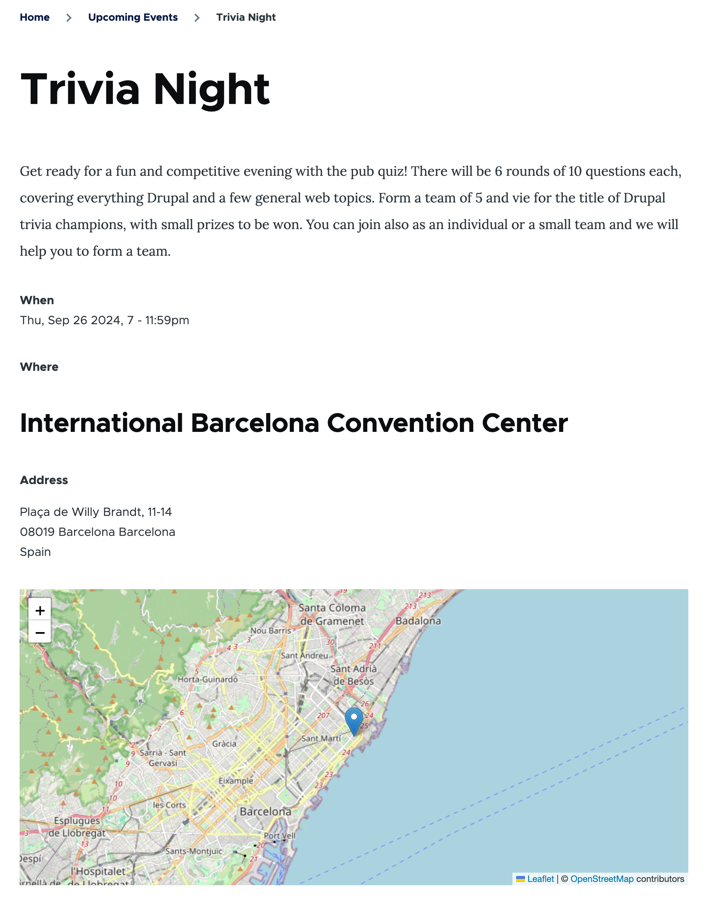
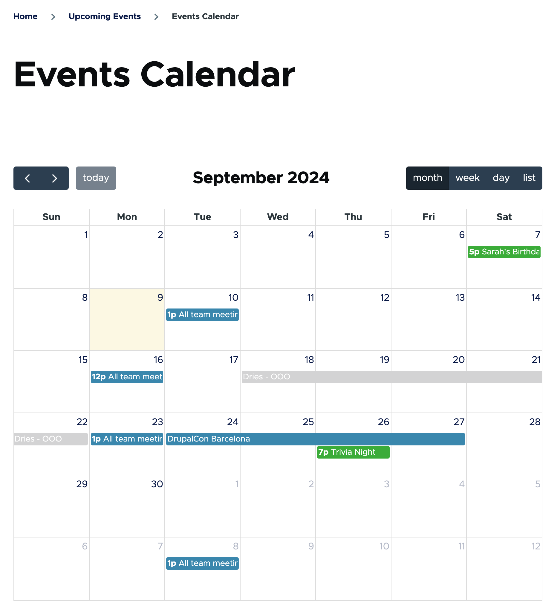

# Concept: Events

## Summary

Whether you are planning a meeting, hosting a party, or getting people together for a weekly coffee, DXPR CMS Events let you tell others about your event.

## What are DXPR CMS Events?

The events feature consists of an _Event_ content type with a date field, and pre-configured listing pages such as a calendar and an archive. Whether you’re building a calendar to track community meetings, a site for listing upcoming games for your soccer league, or the capability of tracking who is registered for an upcoming workshop, the DXPR CMS Events feature is a great starting point.

### Events feature

In order to use the events capabilities the DXPR CMS Events, and Events Locations features must be enabled. Learn more in [Enabling New Features](/bad-link.md).

### Single or recurring events

With DXPR CMS, you can either [create single events](./events--create-single.md) or [create recurring events](./events--create-recurring.md).

If you regularly host the same event, there's no need to start from scratch each time. By setting up a [recurring event](./events--create-recurring.md), you can streamline the process and save time, while still having the flexibility to adjust individual instances.

<!-- 📸Screenshot: A screenshot of an event node page showing example event with location field configured to display as a map. -->

### Browse events

Your site’s users can browse a list of future and past events on the provided _Events_ listing or _Events Calendar_ pages. Both pages can be customized to meet your site’s needs.

<!-- 📸Screenshot: Calendar page provided by events recipe with some example events on it. -->

### View detailed event information

Visitors can select any event in the Events listing or Calendar pages to view event-specific details. This includes a detailed description of the event (including media), a map (for events with a location), and date and time information. All of which can be customized for your specific use case.

The event details page includes handy _Add to calendar_ links to make it straightforward for visitors to add an event to their calendar.

### Manage your guests

With the Event Registration feature enabled, visitors can RSVP to an event, and event managers can see who is coming, email participants, print a list of attendees, check in attendees when they arrive, and more.

### Custom event details

Like all DXPR CMS content types, the base event content type can be extended by adding application-specific fields. Add categories for event types, collect and display links for online meeting spaces, or add a field for uploading event specific documents. Learn more in [Managing DXPR CMS Content Types](/bad-link.md).

## Feedback

Was this tutorial helpful? [yes] | [no]

## Additional resources

- [Create a Single Event](events--create-single.md)
- [Create a Recurring Event](events--create-recurring.md)
- [Manage DXPR CMS Content Types](/bad-link.md)
- [Concept: Features](/bad-link.md)
- [Enabling New Features](/bad-link.md)
